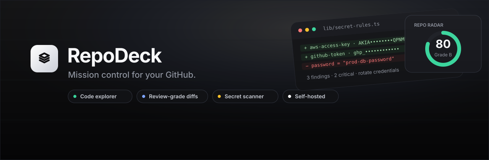
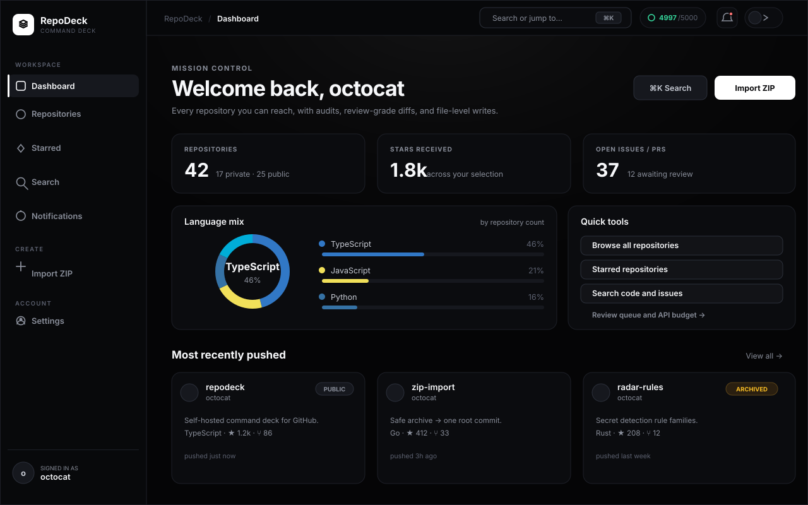
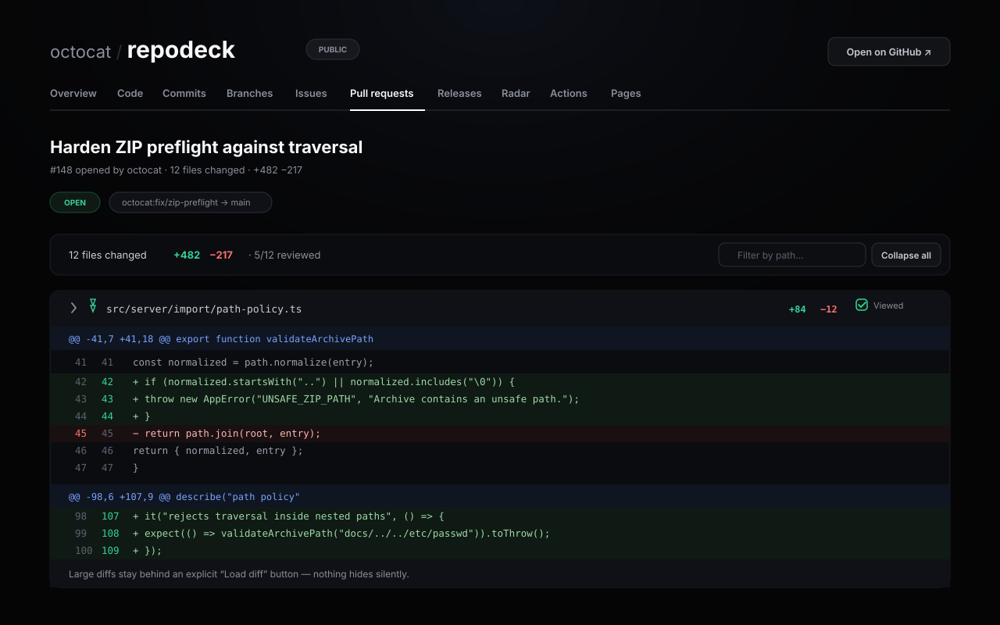
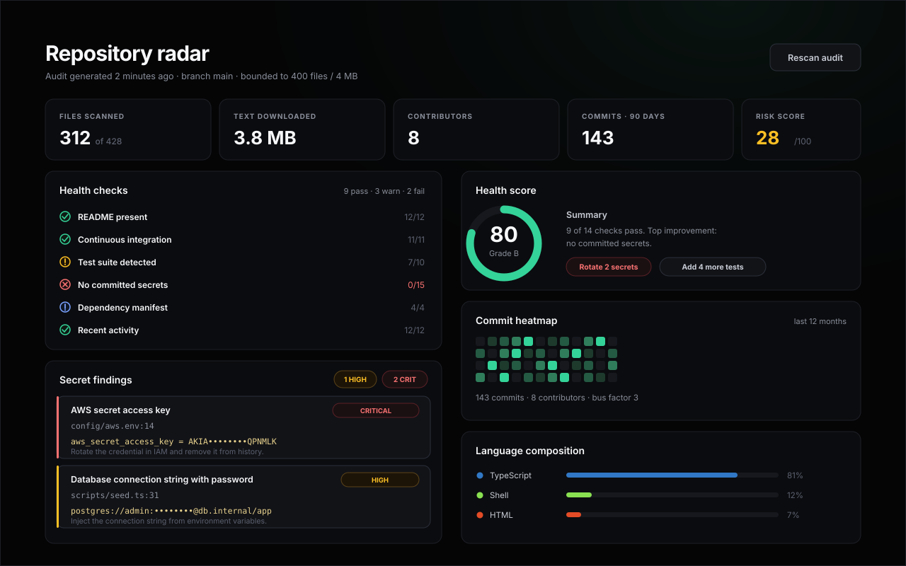
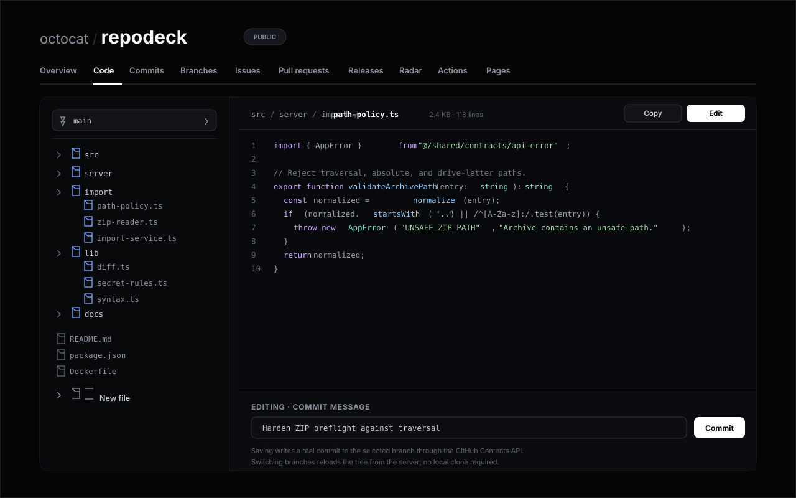
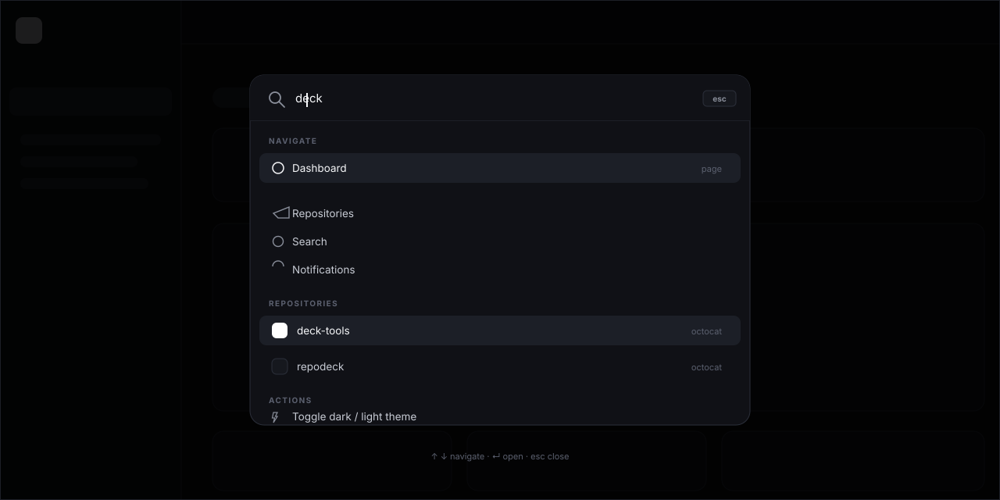

<p align="center">
  
</p>

<h1 align="center">RepoDeck</h1>

<p align="center"><strong>The self-hosted command deck for GitHub.</strong><br>
Explore code, review diffs file by file, audit secrets, ship releases — and keep the token on your own server.</p>

<p align="center">
  <a href="LICENSE"></a>
  <a href="https://github.com/hi77x/ZipGit---Panel/releases/latest"></a>
  <a href="https://github.com/hi77x/ZipGit---Panel/stargazers"></a>
  <a href="https://github.com/hi77x/ZipGit---Panel/issues"></a>
  <a href="https://github.com/hi77x/ZipGit---Panel/pulls"></a>
  <a href="https://github.com/hi77x/ZipGit---Panel/actions/workflows/ci.yml"></a>
</p>

<p align="center">
  
  
  
  
</p>

---

RepoDeck is a control plane for repositories you already host on GitHub. It does not mirror your code and does not store it in a database. It talks to the GitHub API from the server, renders every surface itself, and fixes the workflows developers complain about most: review turbulence, invisible repository health, and missing file-level tooling.

> **Interface previews below are rendered from the actual design system** — the same tokens, spacing, and components that ship in `src/app/globals.css`.

## Contents

- [Capabilities](#capabilities)
- [Interface previews](#interface-previews)
- [Quick start](#quick-start)
- [GitHub OAuth app](#github-oauth-app)
- [Production with Docker](#production-with-docker)
- [Environment variables](#environment-variables)
- [Why RepoDeck](#why-repodeck)
- [Self-written engines](#self-written-engines)
- [API surface](#api-surface)
- [Security model](#security-model)
- [Validation](#validation)
- [Project structure](#project-structure)
- [Roadmap](#roadmap)
- [Contributing](#contributing)
- [License](#license)

## Capabilities

| Area | What you get |
| --- | --- |
| **Code explorer** | Recursive file tree, syntax highlighting for 60+ languages, file editor that commits through the GitHub Contents API, branch create/delete, per-branch browsing |
| **Review-grade diffs** | Per-file collapsible diffs, path filter, persisted "viewed" state, lazy loading for large patches, binary detection, unified parser with exact line numbers |
| **Repo Radar** | Weighted 14-check health score, 27-rule secret scanner with entropy scoring, language composition, contributor map, 12-month heatmap, dependency inventory |
| **Issues & pull requests** | Triage, create, comment, close/reopen, reviews (comment / approve / request changes), files changed, merge (merge / squash / rebase) with branch cleanup |
| **Releases & inbox** | Release create/edit/delete with assets and download counts, notification inbox with unread tracking, starred repositories |
| **Global search** | Repositories, code, and issues through the GitHub Search API |
| **Command deck** | `⌘K` palette with fuzzy repository search, dark/light/system themes, live API budget meter, request IDs |
| **ZIP import** | Publish an archive or folder as one auditable root commit with path, collision, symlink, and secret preflight |
| **Actions & Pages** | Workflow and run listing, dispatch, cancel, re-run, Pages configuration with honest deployed/building/failed states |

## Interface previews

### Mission control



### Review-grade diffs



### Repo Radar



### Code explorer and editor



### Command palette



## Quick start

Three ways to run RepoDeck. Requirements: **Node.js 20.17+** (22.12+ recommended) and a GitHub OAuth App.

### One command — macOS / Linux

```bash
git clone https://github.com/hi77x/ZipGit---Panel.git
cd ZipGit---Panel
./start.sh
```

### One command — Windows

```powershell
git clone https://github.com/hi77x/ZipGit---Panel.git
cd ZipGit---Panel
.\start.ps1
```

Both launchers create `.env`, generate `AUTH_SECRET`, run the environment doctor, install dependencies, and start the dev server. Add `--prod` / `-Prod` to build and run a production server.

### Manual

```bash
npm install
npm run setup     # creates .env and generates AUTH_SECRET
npm run doctor    # validates Node, env, network, and port
npm run dev
```

Open [http://localhost:3000](http://localhost:3000).

## GitHub OAuth app

Create an OAuth App at [github.com/settings/developers](https://github.com/settings/developers):

| Field | Value |
| --- | --- |
| Homepage URL | `http://localhost:3000` (or your public URL) |
| Authorization callback URL | `http://localhost:3000/api/auth/callback/github` |

Then fill in `.env`:

```env
AUTH_GITHUB_ID=...
AUTH_GITHUB_SECRET=...
```

RepoDeck requests the `read:user user:email repo workflow notifications` scopes. Everything else stays inside the server-side encrypted Auth.js JWT session.

## Production with Docker

```bash
cp .env.example .env
# set AUTH_SECRET, AUTH_GITHUB_ID, AUTH_GITHUB_SECRET, NEXT_PUBLIC_APP_URL
docker compose up -d --build
```

The container is a multi-stage, non-root, Node 22 Alpine image built from Next.js standalone output. A named volume is mounted at `/tmp` so large ZIP imports never exhaust the container layer. A health check hits `/api/health` every 30 seconds.

Behind a reverse proxy, forward `X-Forwarded-Proto` / `X-Forwarded-For`, set `NEXT_PUBLIC_APP_URL` to the public HTTPS URL, and let the built-in CSP / HSTS headers do the rest.

## Environment variables

| Variable | Required | Default | Purpose |
| --- | :---: | --- | --- |
| `AUTH_SECRET` | yes | — | Auth.js JWT encryption, minimum 32 characters |
| `AUTH_GITHUB_ID` | yes | — | GitHub OAuth client ID |
| `AUTH_GITHUB_SECRET` | yes | — | GitHub OAuth client secret |
| `NEXT_PUBLIC_APP_URL` | yes | — | Public base URL used for redirects |
| `GITHUB_API_BASE_URL` | no | `https://api.github.com` | GitHub API base (GitHub Enterprise support) |
| `GITHUB_API_VERSION` | no | `2022-11-28` | REST API version header |
| `LOG_LEVEL` | no | `info` | `debug`, `info`, `warn`, `error` |
| `PORT` | no | `3000` | HTTP port |
| `IMPORT_MAX_ZIP_BYTES` | no | `104857600` | Compressed ZIP limit |
| `IMPORT_MAX_UNCOMPRESSED_BYTES` | no | `262144000` | Total uncompressed limit |
| `IMPORT_MAX_FILES` | no | `5000` | Maximum archive entries |
| `IMPORT_MAX_SINGLE_FILE_BYTES` | no | `52428800` | Single-file limit |
| `IMPORT_MAX_SCAN_FILES` | no | `400` | Files read by the content secret scan |
| `IMPORT_MAX_SCAN_FILE_BYTES` | no | `524288` | Per-file secret scan budget |
| `IMPORT_MAX_SCAN_BYTES` | no | `8388608` | Total secret scan budget |
| `IMPORT_MAX_SCAN_FINDINGS` | no | `200` | Maximum findings returned to the browser |
| `REPODECK_ALLOW_REPOSITORY_CLEANUP` | no | `false` | Opt in to deleting repositories created by a failed import (requires `delete_repo`) |
| `REPODECK_COMMIT_SHA` | no | — | Commit SHA reported by health endpoints |
| `OTEL_EXPORTER_OTLP_ENDPOINT` | no | — | Enables optional OpenTelemetry export |

## Why RepoDeck

The feature set comes from current developer pain points, not from a parity checklist:

| GitHub pain point | RepoDeck answer |
| --- | --- |
| “Load diff” hides large files | Diffs are lazy per file, with an explicit **Load diff** only for huge patches |
| Review state is lost between visits | Viewed files persist per pull request and per commit |
| No visibility into review load | Contributor analytics and radar metrics |
| Secrets reach history before anyone notices | 27 rule families with entropy scoring, masked snippets, and remediation |
| Repository health is guesswork | Weighted health score with concrete next actions |
| File editing requires cloning | Edit and commit single files in the browser |
| API budget is invisible | Live rate-limit meter in the top bar |

## Self-written engines

Every analytical engine is implemented in `src/lib`, has unit tests, and adds no runtime dependencies:

| Module | Responsibility |
| --- | --- |
| `diff.ts` | Unified diff parsing, hunk numbering, change classification, large-patch detection |
| `syntax.ts` | Tokenizer for 60+ languages across code, HTML, CSS, JSON, YAML, Markdown, shell, SQL, Python modes |
| `secret-rules.ts` | Secret rule families, Shannon entropy, masking, severity summaries |
| `health.ts` | 14 weighted checks, grading, strengths, improvements |
| `dependencies.ts` | npm, pip, Go, Cargo, Composer, Maven, Gradle manifest detection |
| `fuzzy.ts` | Subsequence scoring with word-boundary bonuses for the command palette |
| `language.ts` | Extension detection, syntax modes, and color mapping |

## API surface

All GitHub traffic goes through **37 allowlisted BFF route handlers** under `src/app/api/github`. Highlights:

- `GET /api/github/repositories` — paginated discovery across owner, collaborator, and organization repositories
- `GET/PUT/DELETE /api/github/repositories/{owner}/{repo}/contents` — tree reads and file writes
- `GET /api/github/repositories/{owner}/{repo}/commits` and `/commits/{sha}` — history and details
- `GET /api/github/repositories/{owner}/{repo}/compare` — branch and commit comparison
- `GET /api/github/repositories/{owner}/{repo}/audit` — the full Repo Radar report
- `GET/POST /api/github/repositories/{owner}/{repo}/issues` — issue lifecycle and comments
- `GET/POST /api/github/repositories/{owner}/{repo}/pulls` — pull requests, reviews, files, merge
- `GET/POST /api/github/repositories/{owner}/{repo}/releases` — releases with assets
- `GET /api/github/search` — repositories, code, and issues
- `GET /api/github/rate-limit` — live API budget

Every response uses the same envelope with `ok`, `data`, `requestId`, and `rateLimit` metadata.

## Security model

- The GitHub access token lives only in the encrypted Auth.js JWT cookie and server request context. It is never returned by `/api/auth/session`, embedded in React props, or written to browser storage.
- Every route is an allowlisted BFF handler with Zod validation, repository accessibility checks, and typed errors.
- Nonce-based CSP with `strict-dynamic`, `frame-ancestors 'none'`, HSTS in production, and no permissive wildcards.
- ZIP import rejects traversal, absolute paths, NUL bytes, collisions, symlinks, encrypted entries, and `.git/**` before GitHub is mutated, then scans file contents for credentials before creating anything.
- Import is failure-atomic: the branch ref is published only after every Git object exists, and a failed operation either removes what it created or reports `cleanup_incomplete` with exact remediation. Repository deletion is opt-in via `REPODECK_ALLOW_REPOSITORY_CLEANUP`, never a required scope.
- Secret findings are masked server-side; raw credentials are never sent to the browser, logs, or traces.

## Validation

```bash
npm run lint
npm run typecheck
npm run test
npm run build
npm run test:e2e   # Playwright with a mock GitHub server
npm run check      # lint + typecheck + tests + production build
```

## Observability

Structured JSON logs with a documented schema are always on. Every request carries a `requestId`; every import carries an `operationId` that links preflight, repository creation, blob writes, tree, commit, ref, compensation, and the final result. Optional vendor-neutral OpenTelemetry traces and metrics are enabled by setting `OTEL_EXPORTER_OTLP_ENDPOINT`. Health is split: `/api/health` and `/api/health/live` are liveness and never call GitHub; `/api/health/ready` validates local configuration only. See [docs/DEBUGGING.md](docs/DEBUGGING.md).

## Project structure

```text
src/app          routing, server components, BFF route handlers
src/components   design system, code/diff viewers, charts, app shell
src/features     client-side feature components and same-origin API calls
src/lib          self-written engines (diff, syntax, secrets, health, fuzzy)
src/server       GitHub transport, services, ZIP import, auth context
src/shared       serializable contracts and typed API envelopes
scripts          setup and environment doctor
docs             interface assets and manual smoke test
```

## Roadmap

- [ ] Webhook-driven activity summaries and saved review filters
- [ ] Diff comments anchored to lines (review threads)
- [ ] Multi-repository dashboards with saved views
- [ ] Optional GitHub Enterprise presets in the UI
- [ ] Exportable audit reports (JSON / SARIF)

## Contributing

Pull requests are welcome. Read [CONTRIBUTING.md](CONTRIBUTING.md) and [AGENTS.md](AGENTS.md) for conventions, then run `npm run check` before opening a PR. Security issues: see [SECURITY.md](SECURITY.md).

## License

[MIT](LICENSE) © RepoDeck contributors.
